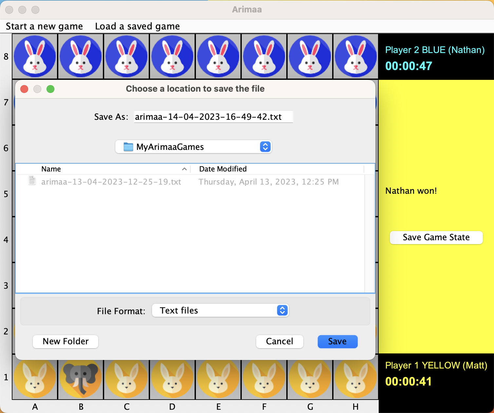
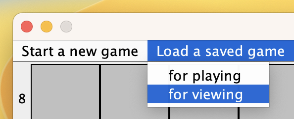
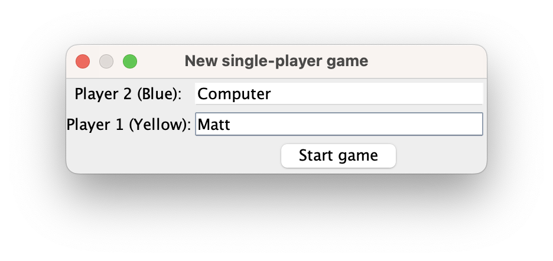

# Arimaa Desktop Application

This is my semester project in *Programming in Java*  [B0B36PJV](https://bilakniha.cvut.cz/en/predmet5010706.html#gsc.tab=0) course as part of my Software Engineering undergraduate curriculum at the Czech Technical University in Prague, CZ, EU.

Designed, developed and programmed by  [Matyas Urban](https://www.linkedin.com/in/matyasurban/)  in Spring 2023.

**To be done (project is still in development):**
- [ ] Random computer considering push and pull moves
- [ ] User testing
- [ ] Unit testing

## Contents of This README
1. [Project Overview](#1-project-overview)
   1. [About Arimaa](#11-about-arimaa)
2. [Technical Documentation](#2-technical-implementation)
   1. [Javadoc](#21-javadoc)
   2. [Application Structure](#22-application-structure)
   3. [Problem Approach](#23-problem-approach)
   4. [Architecture Design](#24-architecture-design)
   5. [Technologies and Features](#25-technologies-and-features)
3. [User Manual](#3-user-manual)
   1. [Open the application](#31-open-the-application)
   2. [Start a new multiplayer game](#32-start-a-new-multiplayer-game)
   3. [Set up the initial positions](#33-set-up-the-initial-positions)
   4. [Play the game](#34-play-the-game)
   5. [Push and pull pieces](#35-push-and-pull-pieces)
   6. [Save the game state](#36-save-the-game-state)
   7. [Continue playing a started game](#37-continue-playing-a-started-game)
   8. [Apply additional game controls](#38-apply-additional-game-controls)
   9. [Examine game history](#39-examine-game-history)
   10. [Play against the computer](#310-play-against-the-computer)

## 1. Project Overview

This project implements [the Arimaa game](http://arimaa.com/arimaa/) in Java including all the game rules, graphical user interface, modes for single-player/multiplayer, logging the game history using the official Arimaa notation and viewing individual steps taken and backtracking them, as well as enabling user to continue playing a game after some time without losing the state of the game, as per course requirements.
### 1.1 About Arimaa
Arimaa is a strategic two-player board game that was designed to be more challenging for artificial intelligence to solve than traditional board games, such as chess. It was invented in 2003 by Omar Syed and has gained popularity due to its simple rules and deep strategy.
- The game is played on an 8x8 grid, much like a chessboard, and each player has 16 pieces of six different types: one elephant, one camel, two horses, two dogs, two cats, and eight rabbits. The pieces are ranked in the order of strength: elephant (strongest), camel, horse, dog, cat, and rabbit (weakest).
- At the start of the game, each player places their pieces on their respective sides of the board within the first two rows. The player with the gold pieces goes first, followed by the player with the silver pieces.
- The objective of the game is to move one of your rabbits to the opposite side of the board, the opponent's home row. Alternatively, you can win by capturing or immobilizing all of your opponent's rabbits.
- During a turn, a player has four "steps" they can use to move their pieces. A piece can move one step horizontally or vertically, but not diagonally. A single piece can use multiple steps, or a player can move multiple pieces using the four steps.
- A unique feature of Arimaa is the concept of "pushing" and "pulling." A stronger piece can push or pull a weaker opponent's piece when they are adjacent to each other. To push, a stronger piece moves an adjacent weaker piece away from itself and moves into the vacated space. To pull, a stronger piece moves away from the weaker adjacent piece and then drags the weaker piece into the vacated space.
- Additionally, the board has four "trap squares." If a piece is on a trap square and there are no friendly pieces adjacent to it, that piece is removed from the game. Also, stronger enemy pieces can "freeze" weaker pieces, making them unable to move. However, friendly pieces can "unfreeze" another friendly piece by moving adjacent to it, allowing it to move freely again. Moreover, friendly pieces adjacent to a trap square can also help another friendly piece step onto that trap without being removed from the game. 

Arimaa's simple ruleset and the depth of strategy required make it an engaging and thought-provoking game for players of all skill levels. The combination of piece movement, pushing, pulling, and the added element of traps offers a rich and dynamic gameplay experience.
## 2. Technical Implementation
### 2.1 Javadoc
A well-documented Javadoc for the entire codebase of the application is to be found [here](https://matyasurban.github.io/Arimaa/).
### 2.2 Application Structure
#### Package `arimaa.core`

In this package, I've created several classes, records, and an interface to represent the core elements of the game.
- `Board`: Represents the Arimaa game board.
- `Game`: Represents one Arimaa gameplay, including the board and two players.
- `GameListener`: An interface for communicating between the Game class and GameControlsPanel.
- `Move`: Represents a move in the Arimaa game.
- `Piece`: A record representing a single piece in the Arimaa game.
- `Player`: Represents a player in the Arimaa game.
- `PullMove`: Represents a pull move in the Arimaa game.
- `PushMove`: Represents a push move in the Arimaa game.
- `StepMove`: Represents a step move in the Arimaa game. 
#### Package `arimaa.gui`

Here, I've designed classes to manage the graphical user interface using Java Swing and AWT:
- `BoardMode`: An enum representing five possible modes of board interactivity.
- `CombinedGUI`: The main frame class managing the entire user-program interaction, displaying and organizing several panels.
- `GameClock`: Facilitates tracking the time spent by each player and shows live information.
- `GameControlsPanel`: Displays information about the current turn, controls for individual moves, and facilitates interaction between the board, game, labeledboardpanel, and game listener.
- `HistoryPanel`: Facilitates reading the game log and displaying it onto the board as the user browses the game history by clicking previous/next move.
- `WelcomePanel`: Represents a basic welcome panel with an overview of the Arimaa rules.
#### Package `arimaa.utils`

In this package, I've defined utility classes and enums for various game elements:
- `Color`: An enum representing the possible colors for a player's pieces.
- `Direction`: An enum representing the four possible directions a piece can move in Arimaa.
- `PieceType`: An enum representing piece types in the Arimaa game.
- `Position`: A record representing a position on the Arimaa game board.
### 2.3 Problem Approach
I've approached the implementation of the Arimaa game by breaking down the problem into smaller components:
1. Defining essential game elements, such as pieces, positions, and players, as distinct classes, records, and enums.
2. Implementing game board logic, including rules for piece movement, capturing, and winning conditions.
3. Developing the graphical user interface using Java Swing and AWT, integrating the game board and user interaction components.
4. Utilizing threads for managing game timers and updating the GUI accordingly.
5. Organizing the code into separate packages for better maintainability and readability.
By following these steps, I've created a comprehensive and user-friendly Arimaa game implementation in Java.
### 2.4 Architecture Design
The architecture of the Arimaa GUI Java Application demonstrates a thoughtful separation of concerns between logic and design. By primarily utilizing communication through the board panel and game controls, the application effectively maintains a distinction between its core gameplay logic and user interface components. This approach allows for increased modularity, ease of maintenance, and adaptability to future changes or enhancements. The application's well-structured design patterns contribute to its overall efficient performance, making it an exemplary implementation of good software architecture principles.
### 2.5 Technologies and Features
By combining several of the following technologies, features, frameworks, and utilities, I've created a well-rounded, approachable, and detailed implementation of the Arimaa game in Java.
#### Object-Oriented Programming (OOP)
I've utilized the core concepts of OOP throughout the implementation, allowing for a modular and maintainable code structure. Key OOP concepts used include:
- **Classes and Objects**: I've defined custom classes to represent game elements such as `Board`, `Game`, `Player`, `Move`, `Piece`, and the various move types.
- **Inheritance**: I've used inheritance to create specialized classes for different move types, such as `PullMove`, `PushMove`, and `StepMove`.
- **Interfaces**: The `GameListener` interface is used to establish communication between the `Game` class and `GameControlsPanel`.
- **Encapsulation**: I've encapsulated the data and behavior of game elements in their respective classes, providing a clear separation of concerns.
#### Enums
Enums are used to define constants with a fixed set of values. In the implementation, I've utilized enums for:
- `Color`: Represents the possible colors for a player's pieces.
- `Direction`: Represents the four possible directions a piece can move in Arimaa.
- `PieceType`: Represents piece types in the Arimaa game.
- `BoardMode`: Represents five possible modes of board interactivity.
#### Records
Records, a feature introduced in Java 16, provide a concise way to define immutable data classes. In the implementation, I've used records for:
- `Piece`: Represents a single piece in the Arimaa game.
- `Position`: Represents a position on the Arimaa game board.
#### Threads
Threads are used to manage game timers and update the GUI accordingly. For instance, the `GameClock` class leverages threads to keep track of each player's time and provide live updates.
#### Java 17
The implementation is based on Java 17, which provides several language improvements, including the aforementioned records.
#### Spring and AWT
Java Swing and AWT are used to build the graphical user interface. Notable components include:
- `CombinedGUI`: The main frame class that manages the entire user-program interaction.
- `GameControlsPanel`, `HistoryPanel`, and `WelcomePanel`: Custom panels for displaying game controls, move history, and an overview of the Arimaa rules.
#### Utilities
I've used various Java utility classes to handle data structures and other operations:
- `ArrayList`: Used to manage lists of game elements, such as positions and directions.
- Other utility methods for operations such as converting an `ArrayList` to an array or obtaining valid adjacent positions.
## 3. User Manual
We'll demonstrate the functionality of the application by executing the following process:
1. [Open the application](#31-open-the-application)
2. [Start a new multiplayer game](#32-start-a-new-multiplayer-game)
3. [Set up the initial positions](#33-set-up-the-initial-positions)
4. [Play the game](#34-play-the-game)
5. [Push and pull pieces](#35-push-and-pull-pieces)
6. [Save the game state](#36-save-the-game-state)
7. [Continue playing a started game](#37-continue-playing-a-started-game)
8. [Apply additional game controls](#38-apply-additional-game-controls)
9. [Examine game history](#39-examine-game-history)
10. [Play against the computer](#310-play-against-the-computer)

There's a lot to cover, let's get started.
### 3.1 Open the application
When you start the program, you are greeted with the following screen outlining basic Arimaa game rules. From here, you can use the menu bar at the top to initiate actions.

### 3.2 Start a new multiplayer game
Navigate to `Start a new game` > `Multiplayer`

Enter the players' names

### 3.3 Set up the initial positions
Your new game and board are now prefilled with initial piece positions. At the top, in blue, you can see Player 2 info, at the bottom, in yellow you can see the Player 1 info. The yellow color of the panel as well as 'Player 1's turn' indicate that it's Matt's turn. Before the game starts, both players have the option to set up their inital positions within the first two home rows. Let's click SWITCH to do that.

White squares in the game always indicate positions you can currently click at (in order to select them and act upon them). The SWITCH indicates that you are now in switch mode, meaning you can edit your initial positions by switching positions of two of your pieces at a time. Yuo are free to do as many switches as you'd like, as the game has not officially started yet. Let's select elephant at A2.

The selected piece becomes green. Again, the white positions are positions you can click at. Shall you select any other square color, your action will be resetted. Let's select the rabbit at B1 to complete the switch.

As you can see, both pieces we selected switched their positions. All pieces are white again, as we are in SWITCH mode. You're free to make other switches, and once you're satisfied with your initial positions, click the finished button.

The finished button is a way of saying, "I'm done with my turn. Let's give controls to the other player." In the context of initial pieces positioning, clicking the finished buttons means you are satisfied with your positions. By clicking it, the controls are give to the blue player.

Let's activate the switch mode and select the camel on b7. Now that the camel is selected, let's switch it with the horse on d7 by clicking that square.

Satisfied with our initial positions we click the finished button.

### 3.4 Play the game
After setting up the initial positions, the yellow player starts and the game clock is on, measuring each player's time and displaying it continously. Also brand new game controls are available. STEP mode for make step moves, PUSH mode for making push moves, and PULL mode for making pull moves. Resign button to, well, resign, and Save game button to same game state with move history into a txt file. By clicking individual move modes, application intelligently analyzes the board, determining which pieces are not freezed, in which directions they can move, and whether they can push/pull other pieces. Such availability is achieved by selecting particular mode and signified by white colored squares available for selection. Let's select the switch mode.

Now we can see that only our pieces in the second row can move. Note that per arimaa rules it is not forbidden to move a piece into a trap and lose it, as would with horse at c2 moved north, so be careful about your selection. We choose to select the horse at d2.

The horse is selected. Arimaa application intelligently analyzes the surrounding and provides valid move options. In this case it is just one up north, since pieces cannot move diagonally. We click the white square as we want to move there. If at any time you dicide you'd rather move a different piece or apply a different type of move, you can click NONE mode, selected pieces itself, or any grey square. We move the horse north 3 times.

In this position you can see that available step moves for horse are 4. Also notice that moves left this turn decreased to one. Let's move once more north. Since the yellow player has no more moves, the controls will be automatically given to the blue player.

### 3.5 Push and pull pieces
Let's try out the push mode. Push and pull mode are specific in that we have to select two pieces, first the enemy's one, then ours. Since both pieces move by one position, they cost us two moves/steps. Thus if you are left with less than that, you will not be able to active push/pull modes. We do have though 4 moves left. Let’s active the push mode so we can see which of the opponent’s pieces we could move.

There is one available opponent’s piece to push move, since the yellow horse is adjacent to our blue camel, which is stronger (also our camel is not frozen at the moment). We select the opponent’s piece.

Now that the opponent’s weaker piece is selected, we need to decide, from white square, which of our pieces will facilitate the pushing or pulling. Again, in this very case there is only one option, our camel at d7, which we select.

Amazing. The opponent’s piece to be pushed is selected and our pushing piece is selected. Again, Arimaa intelligently analyzes the board and provides you with valid available options signified by white squares. The last part of pushing, pulling is about deciding the direction of the move. In our case, it is the best to push the horse onto the trap at c6, so we click this position.

And that is it. The push is complete. Here is how it happens, exactly according the Arimaa notation rules, which you will see shortly in the game log. The yellow horse has been moved d6 west, landed on a trap, there were no yellow pieces nearby so it was removed from the trap. The pushing camel got available space and moved d7 south, now at d6.

### 3.6 Save the game state
To see that in practice, and give ourselves a little break from playing, click Save Game State. It fills out the file name for you and in a visual directory navigator you select the location, where to save our game log. When you locate the file and open it in your Finder/File Explorer, you can review the game log, with the date and time of saving, players’ info, and game log of individual steps.

### 3.7 Continue playing a started game
Another day, another slay, and we want to continue with our nerve-wracking gameplay. Go to Load a saved game > for playing.

Now we select our game state file generated earlier. Note that you cannot select a game state of finished/ended game since there would be nothing to continue.

### 3.8 Apply additional game controls
As you can see, our game loaded exactly where we left off yesterday: with the updated time (which immediately started counting for the blue player, hence 00:00:42), right player turn, moves left, and pieces positioning. Even though we have two more moves left this turn as the blue player, we do not want to use them, and give the turn to the yellow player, something you are allowed to do per Arimaa rules. To do that, we click Finished.

As the yellow player, we are devastated by losing the horse. The blue player convinced us there was no sense in trying to make it up or any chance of winning. Thus we can click the Resign button, which makes the opponent of the player whose turn it currently is immediately the winner of this gameplay.

This is the final state of the game, with the winner being displayed and the ability to save the final game state. Let’s click the Save Game State button.

Again, we get the prompt with the prefilled file name (do not change it) and the ability to choose the location. Click Save when you are finished.

By locating and opening the file, we can inspect the game log. You can see how in the second turn, the blue (g) player only utilized two moves (1 push move, removal from trap is also recorded by x) and in the third turn the yellow player resigned.

### 3.9 Examine game history
To examine the game’s history, click Load a saved game > for viewing.

And select your file. Note that you can examine the game logs of both started as well as finished games.

Now you can see the game examiner interface with loaded steps from each turn as well as two buttons.

It’s simple from here, simply click next, and the application finds the next step in the game log and visualizes it on the board.

By clicking the previous button, an inverse operation from the selected step will be applied. In this way, you can backtrack the game.

### 3.10 Play against the computer
The application features a single-player mode, which you can trigger by Start a new game > Single-player.

Then only need to write the first player’s name, since the name of the second player is automatically allocated to the computer.

Computer mode works like multiplayer, with one important distinction: when it’s the computer’s turn. Your only control option and task is to click the Computer move button. This triggers the computer to select a random valid mode and apply the move.

