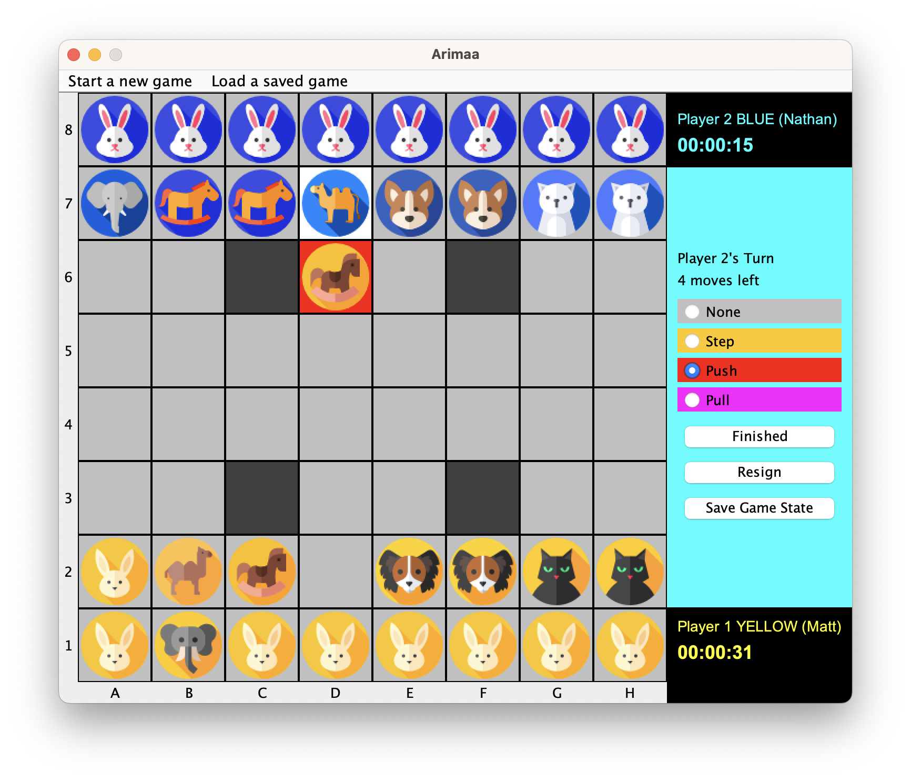
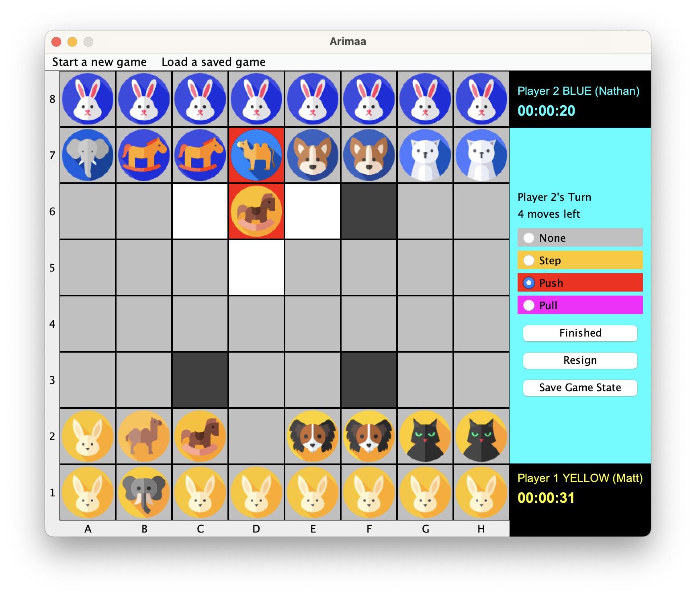
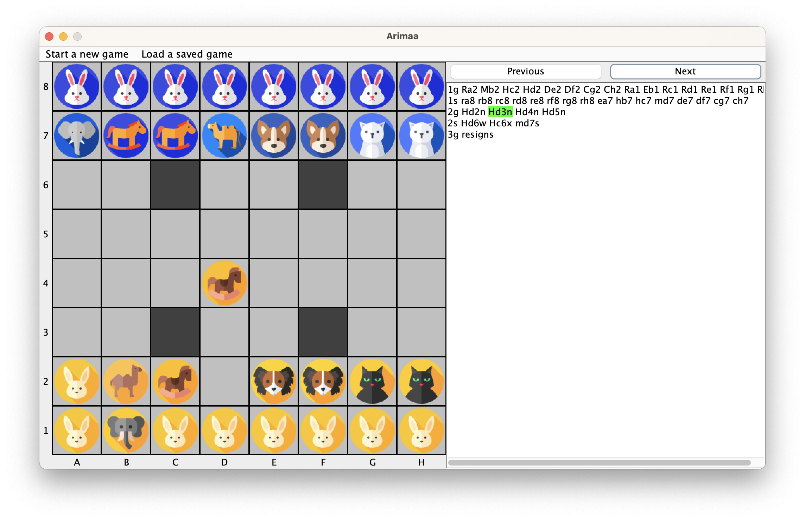
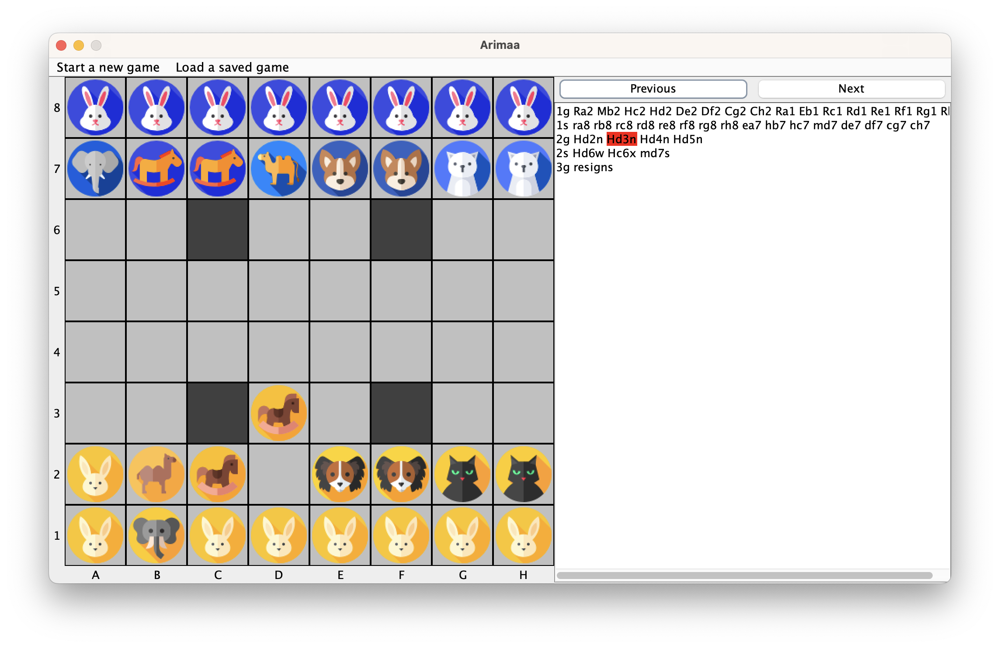

# Arimaa Desktop Application

This is my semester project in *Programming in Java*  [B0B36PJV](https://bilakniha.cvut.cz/en/predmet5010706.html#gsc.tab=0) course as part of my Software Engineering undergraduate curriculum at the Czech Technical University in Prague, CZ, EU.

Designed, developed and programmed by  [Matyas Urban](https://www.linkedin.com/in/matyasurban/)  in Spring 2023.

## Contents of This README
1. [Project Overview](#project-overview)
   1. About Arimaa
2. [Technical Documentation](#technical-documentation)
   1. [Javadoc](#21-javadoc)
   2. [Application Structure](#22-application-structure)
   3. [Problem Approach](#23-problem-approach)
   4. [Architecture Design](#24-architecture-design)
   5. [Technologies and Features](#25-technologies-and-features)
3. [User Manual](#user-manual)

## 1. Project Overview

This project implements [the Arimaa game](http://arimaa.com/arimaa/) in Java including all the game rules, graphical user interface, modes for single-player/multiplayer, logging the game history using the official Arimaa notation and viewing individual steps taken and backtracking them, as well as enabling user to continue playing a game after some time without losing the state of the game, as per course requirements.
### 1.1 Arimaa Overview
Arimaa is a strategic two-player board game that was designed to be more challenging for artificial intelligence to solve than traditional board games, such as chess. It was invented in 2003 by Omar Syed and has gained popularity due to its simple rules and deep strategy.
- The game is played on an 8x8 grid, much like a chessboard, and each player has 16 pieces of six different types: one elephant, one camel, two horses, two dogs, two cats, and eight rabbits. The pieces are ranked in the order of strength: elephant (strongest), camel, horse, dog, cat, and rabbit (weakest).
- At the start of the game, each player places their pieces on their respective sides of the board within the first two rows. The player with the gold pieces goes first, followed by the player with the silver pieces.
- The objective of the game is to move one of your rabbits to the opposite side of the board, the opponent's home row. Alternatively, you can win by capturing or immobilizing all of your opponent's rabbits.
- During a turn, a player has four "steps" they can use to move their pieces. A piece can move one step horizontally or vertically, but not diagonally. A single piece can use multiple steps, or a player can move multiple pieces using the four steps.
- A unique feature of Arimaa is the concept of "pushing" and "pulling." A stronger piece can push or pull a weaker opponent's piece when they are adjacent to each other. To push, a stronger piece moves an adjacent weaker piece away from itself and moves into the vacated space. To pull, a stronger piece moves away from the weaker adjacent piece and then drags the weaker piece into the vacated space.
- Additionally, the board has four "trap squares." If a piece is on a trap square and there are no friendly pieces adjacent to it, that piece is removed from the game. Also, stronger enemy pieces can "freeze" weaker pieces, making them unable to move. However, friendly pieces can "unfreeze" another friendly piece by moving adjacent to it, allowing it to move freely again. Moreover, friendly pieces adjacent to a trap square can also help another friendly piece step onto that trap without being removed from the game. 

Arimaa's simple ruleset and the depth of strategy required make it an engaging and thought-provoking game for players of all skill levels. The combination of piece movement, pushing, pulling, and the added element of traps offers a rich and dynamic gameplay experience.
## 2. Technical Implementation
### 2.1 Javadoc
A well-documented Javadoc for the entire codebase of the application is to be found [here](https://matyasurban.github.io/Arimaa/).
### 2.2 Application Structure
#### Package `arimaa.core`

In this package, I've created several classes, records, and an interface to represent the core elements of the game.
- `Board`: Represents the Arimaa game board.
- `Game`: Represents one Arimaa gameplay, including the board and two players.
- `GameListener`: An interface for communicating between the Game class and GameControlsPanel.
- `Move`: Represents a move in the Arimaa game.
- `Piece`: A record representing a single piece in the Arimaa game.
- `Player`: Represents a player in the Arimaa game.
- `PullMove`: Represents a pull move in the Arimaa game.
- `PushMove`: Represents a push move in the Arimaa game.
- `StepMove`: Represents a step move in the Arimaa game. 
#### Package `arimaa.gui`

Here, I've designed classes to manage the graphical user interface using Java Swing and AWT:
- `BoardMode`: An enum representing five possible modes of board interactivity.
- `CombinedGUI`: The main frame class managing the entire user-program interaction, displaying and organizing several panels.
- `GameClock`: Facilitates tracking the time spent by each player and shows live information.
- `GameControlsPanel`: Displays information about the current turn, controls for individual moves, and facilitates interaction between the board, game, labeledboardpanel, and game listener.
- `HistoryPanel`: Facilitates reading the game log and displaying it onto the board as the user browses the game history by clicking previous/next move.
- `WelcomePanel`: Represents a basic welcome panel with an overview of the Arimaa rules.
#### Package `arimaa.utils`

In this package, I've defined utility classes and enums for various game elements:
- `Color`: An enum representing the possible colors for a player's pieces.
- `Direction`: An enum representing the four possible directions a piece can move in Arimaa.
- `PieceType`: An enum representing piece types in the Arimaa game.
- `Position`: A record representing a position on the Arimaa game board.
### 2.3 Problem Approach
I've approached the implementation of the Arimaa game by breaking down the problem into smaller components:
1. Defining essential game elements, such as pieces, positions, and players, as distinct classes, records, and enums.
2. Implementing game board logic, including rules for piece movement, capturing, and winning conditions.
3. Developing the graphical user interface using Java Swing and AWT, integrating the game board and user interaction components.
4. Utilizing threads for managing game timers and updating the GUI accordingly.
5. Organizing the code into separate packages for better maintainability and readability.
By following these steps, I've created a comprehensive and user-friendly Arimaa game implementation in Java.
### 2.4 Architecture Design
The architecture of the Arimaa GUI Java Application demonstrates a thoughtful separation of concerns between logic and design. By primarily utilizing communication through the board panel and game controls, the application effectively maintains a distinction between its core gameplay logic and user interface components. This approach allows for increased modularity, ease of maintenance, and adaptability to future changes or enhancements. The application's well-structured design patterns contribute to its overall efficient performance, making it an exemplary implementation of good software architecture principles.
### 2.5 Technologies and Features
By combining several of the following technologies, features, frameworks, and utilities, I've created a well-rounded, approachable, and detailed implementation of the Arimaa game in Java.
#### Object-Oriented Programming (OOP)
I've utilized the core concepts of OOP throughout the implementation, allowing for a modular and maintainable code structure. Key OOP concepts used include:
- **Classes and Objects**: I've defined custom classes to represent game elements such as `Board`, `Game`, `Player`, `Move`, `Piece`, and the various move types.
- **Inheritance**: I've used inheritance to create specialized classes for different move types, such as `PullMove`, `PushMove`, and `StepMove`.
- **Interfaces**: The `GameListener` interface is used to establish communication between the `Game` class and `GameControlsPanel`.
- **Encapsulation**: I've encapsulated the data and behavior of game elements in their respective classes, providing a clear separation of concerns.
#### Enums
Enums are used to define constants with a fixed set of values. In the implementation, I've utilized enums for:
- `Color`: Represents the possible colors for a player's pieces.
- `Direction`: Represents the four possible directions a piece can move in Arimaa.
- `PieceType`: Represents piece types in the Arimaa game.
- `BoardMode`: Represents five possible modes of board interactivity.
#### Records
Records, a feature introduced in Java 16, provide a concise way to define immutable data classes. In the implementation, I've used records for:
- `Piece`: Represents a single piece in the Arimaa game.
- `Position`: Represents a position on the Arimaa game board.
#### Threads
Threads are used to manage game timers and update the GUI accordingly. For instance, the `GameClock` class leverages threads to keep track of each player's time and provide live updates.
#### Java 17
The implementation is based on Java 17, which provides several language improvements, including the aforementioned records.
#### Spring and AWT
Java Swing and AWT are used to build the graphical user interface. Notable components include:
- `CombinedGUI`: The main frame class that manages the entire user-program interaction.
- `GameControlsPanel`, `HistoryPanel`, and `WelcomePanel`: Custom panels for displaying game controls, move history, and an overview of the Arimaa rules.
#### Utilities
I've used various Java utility classes to handle data structures and other operations:
- `ArrayList`: Used to manage lists of game elements, such as positions and directions.
- Other utility methods for operations such as converting an `ArrayList` to an array or obtaining valid adjacent positions.
## 3. User Manual
We'll demonstrate the functionality of the application by executing the following process:
1. Start the application
2. Start a new multiplayer game
3. Set up the initial positions
4. Play a few moves
5. Save the game
6. Start a continuing game loaded from a file
7. Discover more game options for winning/ending
8. Save the game
9. Replay steps of the game loaded from a file
10. Introduce single-player (against computer) mode
### Start the application
When you start the program, you are greeted with the following screen, outlining basic Arimaa game rules. From here you can use the menu bar at the top to initiate actions.

### Start a new multiplayer game
Navigate to `Start a new game` > `Multiplayer`

Enter the players' names

### Set up the initial positions
Your new game and board is now prefilled with initial piece positions. At the top in blue you can see Player 2 info, at the bottom in yellow you can see the Player 1 info. The yellow color of the panel as well as 'Player 1's turn' indicate that it's Matt's turn. Before the game starts, both players have the option to set up their inital positions within the first two home rows. Let's click SWITCH to do that.

White squares in the game always indicate positions you can currently click at (in order to select them and act upon them). The SWITCH indicates that you are now in switch mode, meaning you can edit your initial positions by switching positions of two of your pieces at a time. Yuo are free to do as many switches as you'd like, as the game has not officially started yet. Let's select elephant at A2.

The selected piece becomes green. Again, the white positions are positions you can click at. Shall you select any other square color, your action will be resetted. Let's select the rabbit at B1 to complete the switch.

As you can see, both pieces we selected switched their positions. All pieces are white again, as we are in SWITCH mode. You're free to make other switches, and once you're satisfied with your initial positions, click the finished button.

The finished button is a way of saying, ""

